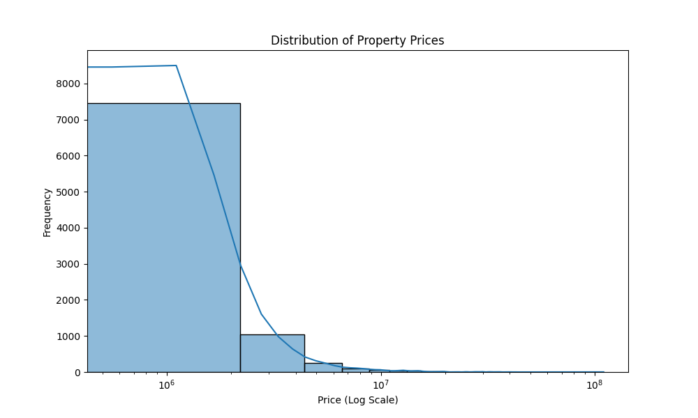
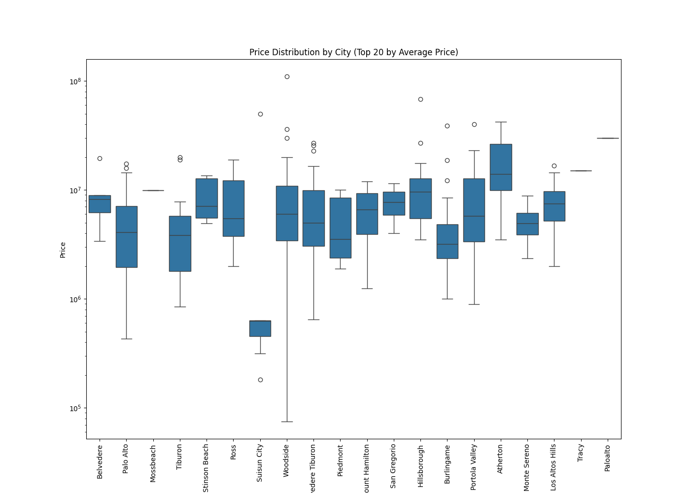

```markdown
# Real Estate Market Analysis Tool

## Project Overview

This project scrapes property listings from a real estate website, analyzes the data, and provides insights into pricing trends. The analysis includes data cleaning, exploratory data analysis (EDA), and visualization of key metrics such as property prices, sizes, and distributions by city and number of bedrooms.

## Setup Instructions

### Prerequisites

- Python 3.x
- `virtualenv` or `venv` for creating a virtual environment

### Installation

1. **Clone the repository:**

    ```sh
    git clone https://github.com/your-username/real_estate_analysis.git
    cd real_estate_analysis
    ```

2. **Create a virtual environment:**

    ```sh
    python3 -m venv venv
    source venv/bin/activate  # On Windows use `venv\Scripts\activate`
    ```

3. **Install dependencies:**

    ```sh
    pip install -r requirements.txt
    ```

## Data Cleaning

The `data_cleaning.py` script loads the raw data, cleans it, and saves the cleaned data.

**Run the data cleaning script:**

```sh
python3 src/data_cleaning.py
```

The cleaned data will be saved in `data/processed/cleaned_zillow_data.csv`.

## Exploratory Data Analysis (EDA)

The `exploratory_analysis.py` script performs exploratory data analysis and generates plots for visualizing the data.

**Run the EDA script:**

```sh
python3 src/exploratory_analysis.py
```

The plots will be saved in the `data/plots` directory.

## Visualizations

The following visualizations are generated as part of the EDA:

1. **Distribution of Property Prices:** `price_distribution.png`
    - This plot shows the distribution of property prices, using a logarithmic scale on the x-axis to better visualize the range of prices.
    
    

2. **Price vs Square Footage:** `price_vs_area.png`
    - This scatter plot shows the relationship between the price of properties and their square footage, with both axes on a logarithmic scale to capture the wide range of values.
    
    

3. **Average Price by Number of Bedrooms:** `avg_price_by_beds.png`
    - This bar plot shows the average price of properties grouped by the number of bedrooms. The y-axis is scaled logarithmically to account for the large variation in prices.
    
    

4. **Price Distribution by City:** `price_distribution_by_city.png`
    - This box plot shows the distribution of property prices in different cities, allowing for comparison across locations.
    
    

## Project Files

- **data_cleaning.py:** Script for cleaning the raw data.
- **exploratory_analysis.py:** Script for performing EDA and generating visualizations.
- **scraper.py:** (If applicable) Script for scraping raw data from a source.
- **requirements.txt:** List of Python dependencies required for the project.